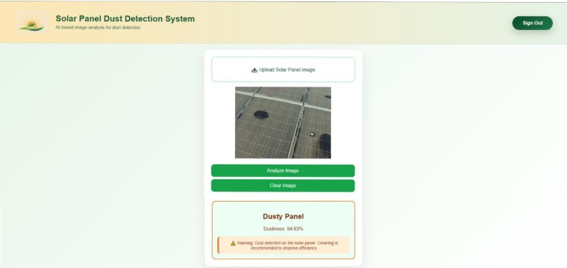

# Dust Detection of Solar Panels
## Designing and developing a deep learning–based system to detect dust accumulation on solar panels using image classification techniques. The system analyzes panel images with machine learning models to classify dust severity levels and estimate dust percentage. Users can upload images through a web interface and instantly receive information about the dust level on their solar panels, helping to optimize cleaning schedules and improve energy efficiency.

## User Interface

### Login Page

### Register Page

### Home Page

